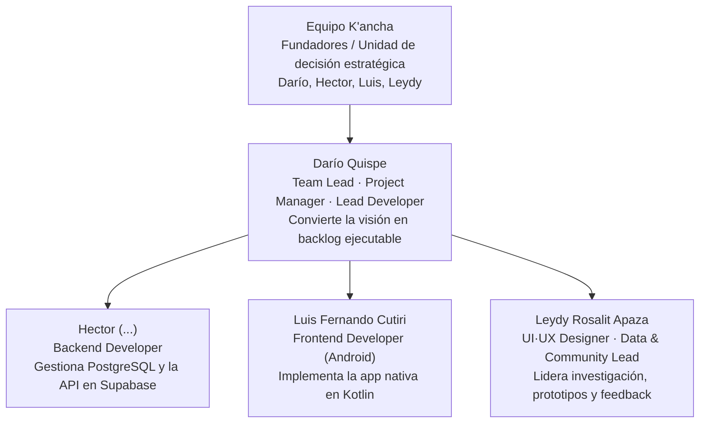
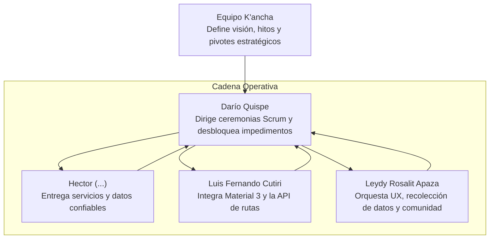
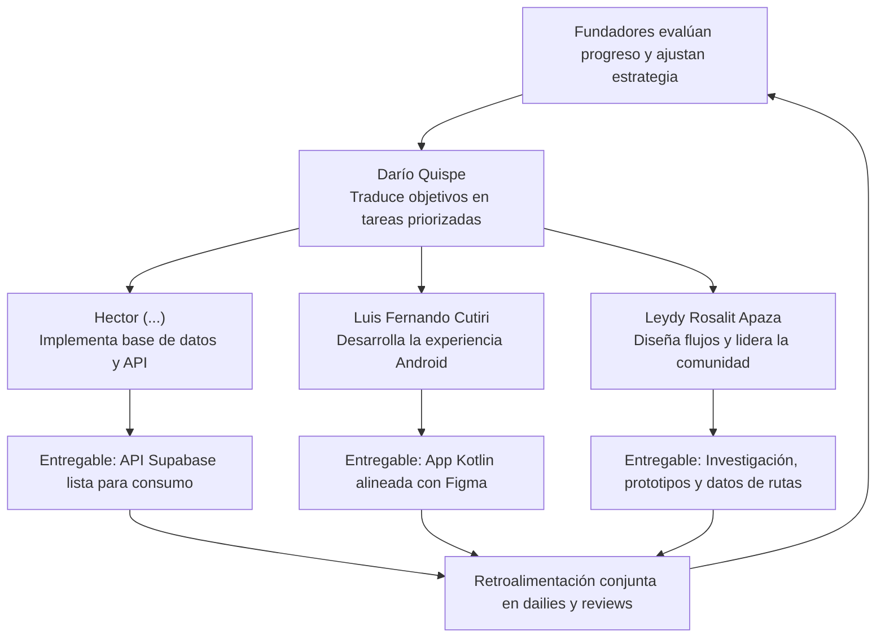

# Organigrama del Proyecto Ruta K'ancha

Este documento muestra tres diagramas de flujo que ejemplifican la estructura organizacional híbrida descrita para el equipo Ruta K'ancha. Cada gráfico utiliza sintaxis Mermaid compatible con GitHub.

## Diagrama 1: Vista General del Organigrama

## Diagrama 2: Cadena de Coordinación Operativa

## Diagrama 3: Flujo de Retroalimentación y Entregables

