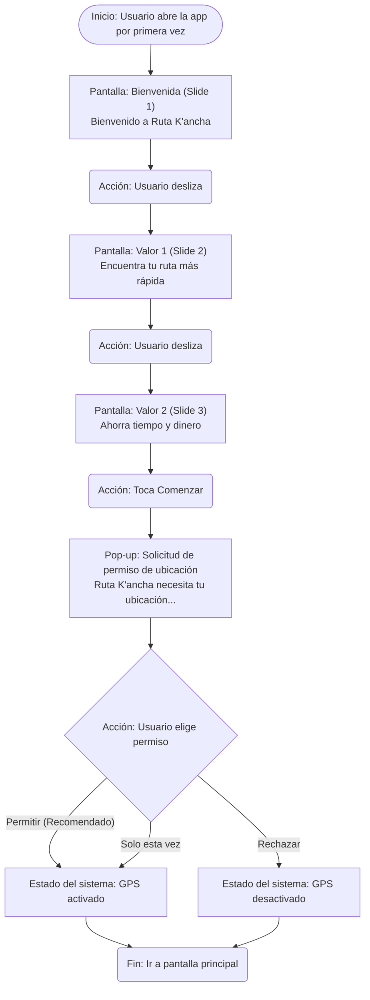

# Diagramas de Flujo - Ruta K'ancha

Este documento presenta los diagramas de flujo para los tres flujos principales del prototipo de la aplicación Ruta K'ancha. Cada diagrama está definido utilizando la sintaxis Mermaid (flowchart TD).

## Flujo 1: Onboarding (Carrusel de Bienvenida)



## Flujo 2: Planificar un Viaje (A -> B)

```mermaid
flowchart TD
    subgraph Ingreso_de_Datos [Ingreso de datos]
        IA[Pantalla: Inicio (Mapa)] --> IB(Acción: Toca barra «Adónde vas?»)
        IB --> IC["Pantalla: Búsqueda (inputs)<br/>Origen: Tu ubicación (actual)<br/>Destino: vacío"]

        IC --> ID{¿Usuario cambia origen?}
        ID -- Sí --> IE["Pantalla: Seleccionar origen<br/>Buscar o elegir en mapa"]
        IE --> IF(Acción: Selecciona Plaza de Armas)
        IF --> IG["Pantalla: Búsqueda (inputs)<br/>Origen: Plaza de Armas<br/>Destino: vacío"]

        ID -- No, usa ubicación actual --> IG

        IG --> IH["Acción: Escribe y selecciona destino<br/>Ejemplo: UANCV"]
        IH --> II(Acción: Toca botón Buscar)
    end

    subgraph Calculo_y_Resultados [Cálculo y resultados]
        II --> JJ{Sistema: Calcula rutas A→B}

        JJ -- Fallo, sin rutas --> KK["Pantalla: Resultados (vacía)<br/>No se encontraron rutas directas.<br/>Intenta con otro destino."]
        KK --> LL(Acción: Toca Atrás)
        LL --> IC

        JJ -- Éxito, rutas encontradas --> MM["Pantalla: Resultados (lista)<br/>Rutas sugeridas (1-3 opciones)"]
        MM --> MM1(Opción 1: Línea 10)
        MM --> MM2(Opción 2: Línea 15)

        MM1 --> NN(Acción: Toca una opción)
        MM2 --> NN

        NN --> OO["Pantalla: Detalle de viaje (navegación)<br/>Muestra mapa A→B y pasos"]
        OO --> PP["Pasos:<br/>1. Caminar a Paradero X<br/>2. Tomar Línea 10<br/>3. Bajar en Paradero Y..."]
        PP --> QQ(Fin del flujo)
    end
```

## Flujo 3: Exploración de Rutas (Biblioteca)

```mermaid
flowchart TD
    A1[Pantalla: Inicio (Mapa)] --> B1(Acción: Toca pestaña Explorar)
    B1 --> C1["Pantalla: Explorar (lista)<br/>Barra de búsqueda y listado completo"]

    C1 --> D1{¿Usuario usa búsqueda?}
    D1 -- Sí --> E1(Acción: Escribe Línea 10)
    E1 --> F1["Pantalla: Explorar (lista filtrada)<br/>Solo muestra Línea 10"]

    D1 -- No, navega la lista --> G1(Acción: Toca Línea 10)
    F1 --> G1

    G1 --> H1["Pantalla: Detalle de ruta (mapa)<br/>Trazado completo de Línea 10"]
    H1 --> I1[Panel informativo:<br/>Línea 10 | Ícono Guardar (futuro)]

    H1 --> J1(Acción: Toca Atrás)
    J1 --> C1
    H1 --> K1(Fin del flujo)
```
