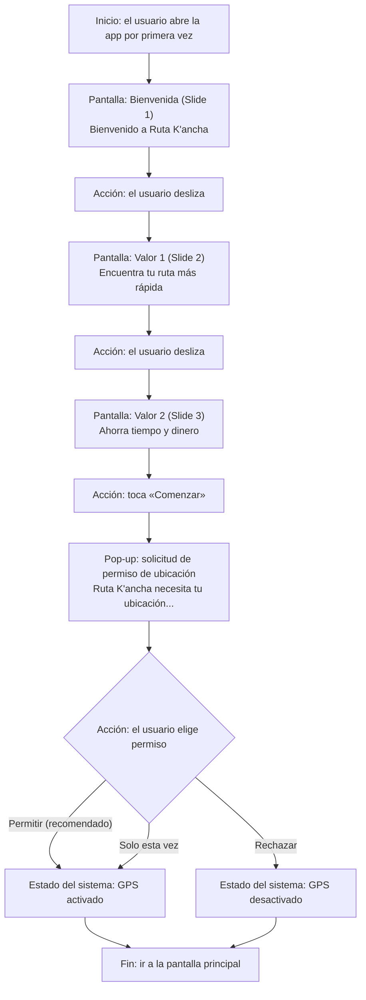
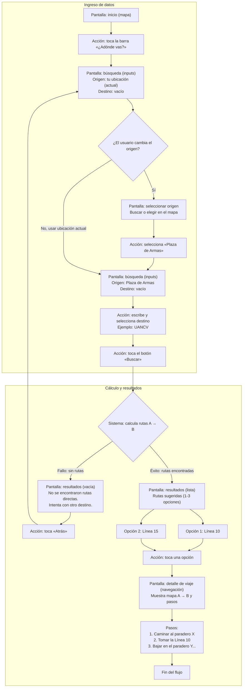
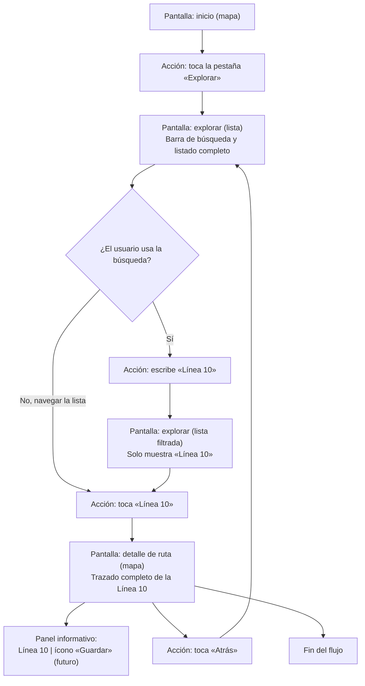

# Diagramas de Flujo - Ruta K'ancha

Este documento presenta los diagramas de flujo para los tres flujos principales del prototipo de la aplicación Ruta K'ancha. Cada diagrama está definido utilizando la sintaxis Mermaid (flowchart TD).

## Flujo 1: Onboarding (Carrusel de Bienvenida)

## Flujo 2: Planificar un Viaje (A -> B)

## Flujo 3: Exploración de Rutas (Biblioteca)

