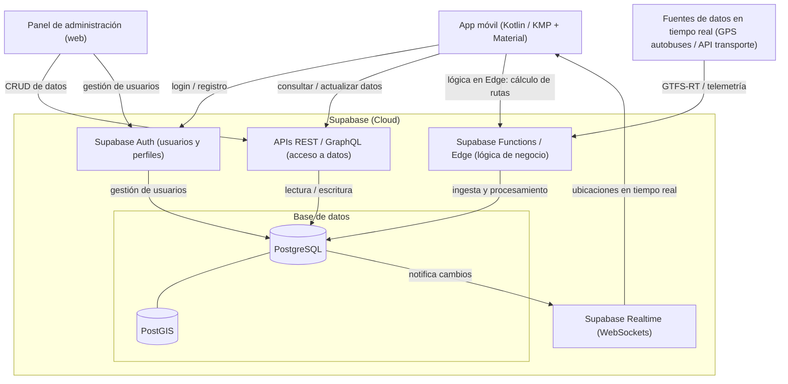

```mermaid
flowchart TD
  %% Clientes
  UserApp["App móvil (Kotlin / KMP + Material)"]
  Admin["Panel de administración (web)"]

  %% Fuentes externas
  RTSRC["Fuentes de datos en tiempo real (GPS autobuses / API transporte)"]

  %% Backend Supabase
  subgraph SUPABASE["Supabase (Cloud)"]
    direction TB
    AUTH["Supabase Auth (usuarios y perfiles)"]
    API["APIs REST / GraphQL (acceso a datos)"]
    EDGE["Supabase Functions / Edge (lógica de negocio)"]
    RT["Supabase Realtime (WebSockets)"]

    subgraph DB["Base de datos"]
      PG[(PostgreSQL)]
      GIS[(PostGIS)]
      PG --- GIS
    end

    AUTH -->|"gestión de usuarios"| PG
    API  -->|"lectura / escritura"| PG
    EDGE -->|"ingesta y procesamiento"| PG
    PG   -->|"notifica cambios"| RT
  end

  %% Ingesta de datos en tiempo real
  RTSRC -->|"GTFS-RT / telemetría"| EDGE

  %% Flujos App móvil
  UserApp -->|"login / registro"| AUTH
  UserApp -->|"consultar / actualizar datos"| API
  UserApp -->|"lógica en Edge: cálculo de rutas"| EDGE
  RT -->|"ubicaciones en tiempo real"| UserApp

  %% Flujos Panel Admin
  Admin -->|"CRUD de datos"| API
  Admin -->|"gestión de usuarios"| AUTH

```