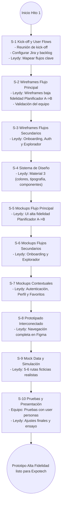

# Diagramas de Flujogramas de Desarrollo - Ruta K'ancha

Este documento resume, en diagramas de flujo (Mermaid), la secuencia de sprints planificada para alcanzar los hitos del proyecto "Ruta K'ancha". Los nodos incluyen las tareas principales y responsables por sprint, siguiendo el roadmap establecido.

## Hito 1: Prototipo en Figma (Sprints 1 - 10)



flowchart TD
    start2((Inicio Hito 2)) --> E2A["EPIC 2: Cimientos Técnicos"]

    subgraph EPIC 2: Cimientos Técnicos
        direction TB
        E2A --> S11["S-11 Arquitectura Backend\n- Hector: Diseñar esquema PostgreSQL"]
        S11 --> S12["S-12 Setup Backend y Auth\n- Hector: Supabase + tablas + Auth"]
        S12 --> S13["S-13 Setup Proyecto Android\n- Darío: Repo y reglas Git\n- Darío/Luis: Proyecto Kotlin MVVM"]
        S13 --> S14["S-14 Conexión Auth Frontend\n- Luis: UI Login/Registro conectada a Supabase"]
        S14 --> S15["S-15 Módulo Perfil\n- Hector: Endpoints CRUD\n- Luis: Pantalla Mi Perfil"]
    end

    S15 --> E3A["EPIC 3: Explorador de Rutas"]

    subgraph EPIC 3: Explorador de Rutas
        direction TB
        E3A --> S16["S-16 Endpoints de Rutas\n- Hector: API GET /rutas y detalle"]
        S16 --> S17["S-17 Mapeo y Carga Piloto\n- Leydy: Dataset piloto 5 rutas\n- Hector: Ingesta BBDD"]
        S17 --> S18["S-18 Explorador (Lista)\n- Luis: Pantalla Explorar consume API"]
        S18 --> S19["S-19 Explorador (Mapa)\n- Darío: Integrar MapLibre y dibujar ruta"]
        S19 --> S20["S-20 Explorador (Detalle)\n- Luis: UI detalle con paraderos"]
    end

    S20 --> E4A["EPIC 4: Planificador de Rutas"]

    %% --- ESTA ES LA LÍNEA CORREGIDA ---
    subgraph "EPIC 4: Planificador A->B"
    %% -----------------------------------
        direction TB
        E4A --> S21["S-21 Algoritmo Planificador I+D\n- Darío/Hector: Investigación PostGIS"]
        S21 --> S22["S-22 Algoritmo Planificador Backend\n- Hector: Endpoint /planificar"]
        S22 --> S23["S-23 Planificador UI Mapa\n- Darío: Selección Origen/Destino"]
        S23 --> S24["S-24 Planificador Resultados\n- Luis: Listado de opciones"]
        S24 --> S25["S-25 Planificador Navegación\n- Darío: Mostrar trayecto en mapa"]
        S25 --> S26["S-26 Refinamiento Algoritmo\n- Hector: Optimización con rutas piloto"]
    end

    S26 --> E5A["EPIC 5: Funciones Complementarias"]

    subgraph EPIC 5: Funciones Complementarias
        direction TB
        E5A --> S27["S-27 Rutas Favoritas Backend\n- Hector: API favoritos"]
        S27 --> S28["S-28 Rutas Favoritas Frontend\n- Luis: Guardar y listar favoritos"]
        S28 --> S29["S-29 Modo Oscuro\n- Luis: Theming completo"]
        S29 --> S30["S-30 Onboarding Frontend\n- Darío: Tutorial inicial"]
        S30 --> S31["S-31 Mapeo Intensivo Datos\n- Leydy: Cobertura 80% rutas\n- Hector: Ingesta masiva"]
    end

    S31 --> E6A["EPIC 6: Pruebas y Lanzamiento"]

    subgraph EPIC 6: Pruebas y Lanzamiento
        direction TB
        E6A --> S32["S-32 Pruebas Internas Alpha\n- Equipo: Pruebas de campo y reporte"]
        S32 --> S33["S-33 Corrección de Bugs\n- Darío/Luis/Hector: Resolución crítica"]
        S33 --> S34["S-34 Mapeo Cierre 100%\n- Leydy: Rutas restantes\n- Hector: Validación final"]
        S34 --> S35["S-35 Pruebas Beta\n- Equipo: Go/No-Go"]
        S35 --> S36["S-36 Lanzamiento Play Store\n- Darío: Ficha Play Store\n- Equipo: Publicación y monitoreo"]
    end

    S36 --> end2((MVP Android listo y publicado))

## Hito 2: MVP Funcional (Sprints 11 - 36)

```mermaid
flowchart TD
    start2((Inicio Hito 2)) --> E2A["EPIC 2: Cimientos Técnicos"]

    subgraph EPIC 2: Cimientos Técnicos
        direction TB
        E2A --> S11["S-11 Arquitectura Backend\n- Hector: Diseñar esquema PostgreSQL"]
        S11 --> S12["S-12 Setup Backend y Auth\n- Hector: Supabase + tablas + Auth"]
        S12 --> S13["S-13 Setup Proyecto Android\n- Darío: Repo y reglas Git\n- Darío/Luis: Proyecto Kotlin MVVM"]
        S13 --> S14["S-14 Conexión Auth Frontend\n- Luis: UI Login/Registro conectada a Supabase"]
        S14 --> S15["S-15 Módulo Perfil\n- Hector: Endpoints CRUD\n- Luis: Pantalla Mi Perfil"]
    end

    S15 --> E3A["EPIC 3: Explorador de Rutas"]

    subgraph EPIC 3: Explorador de Rutas
        direction TB
        E3A --> S16["S-16 Endpoints de Rutas\n- Hector: API GET /rutas y detalle"]
        S16 --> S17["S-17 Mapeo y Carga Piloto\n- Leydy: Dataset piloto 5 rutas\n- Hector: Ingesta BBDD"]
        S17 --> S18["S-18 Explorador (Lista)\n- Luis: Pantalla Explorar consume API"]
        S18 --> S19["S-19 Explorador (Mapa)\n- Darío: Integrar MapLibre y dibujar ruta"]
        S19 --> S20["S-20 Explorador (Detalle)\n- Luis: UI detalle con paraderos"]
    end

    S20 --> E4A["EPIC 4: Planificador de Rutas"]

    subgraph EPIC 4: Planificador A->B
        direction TB
        E4A --> S21["S-21 Algoritmo Planificador I+D\n- Darío/Hector: Investigación PostGIS"]
        S21 --> S22["S-22 Algoritmo Planificador Backend\n- Hector: Endpoint /planificar"]
        S22 --> S23["S-23 Planificador UI Mapa\n- Darío: Selección Origen/Destino"]
        S23 --> S24["S-24 Planificador Resultados\n- Luis: Listado de opciones"]
        S24 --> S25["S-25 Planificador Navegación\n- Darío: Mostrar trayecto en mapa"]
        S25 --> S26["S-26 Refinamiento Algoritmo\n- Hector: Optimización con rutas piloto"]
    end

    S26 --> E5A["EPIC 5: Funciones Complementarias"]

    subgraph EPIC 5: Funciones Complementarias
        direction TB
        E5A --> S27["S-27 Rutas Favoritas Backend\n- Hector: API favoritos"]
        S27 --> S28["S-28 Rutas Favoritas Frontend\n- Luis: Guardar y listar favoritos"]
        S28 --> S29["S-29 Modo Oscuro\n- Luis: Theming completo"]
        S29 --> S30["S-30 Onboarding Frontend\n- Darío: Tutorial inicial"]
        S30 --> S31["S-31 Mapeo Intensivo Datos\n- Leydy: Cobertura 80% rutas\n- Hector: Ingesta masiva"]
    end

    S31 --> E6A["EPIC 6: Pruebas y Lanzamiento"]

    subgraph EPIC 6: Pruebas y Lanzamiento
        direction TB
        E6A --> S32["S-32 Pruebas Internas Alpha\n- Equipo: Pruebas de campo y reporte"]
        S32 --> S33["S-33 Corrección de Bugs\n- Darío/Luis/Hector: Resolución crítica"]
        S33 --> S34["S-34 Mapeo Cierre 100%\n- Leydy: Rutas restantes\n- Hector: Validación final"]
        S34 --> S35["S-35 Pruebas Beta\n- Equipo: Go/No-Go"]
        S35 --> S36["S-36 Lanzamiento Play Store\n- Darío: Ficha Play Store\n- Equipo: Publicación y monitoreo"]
    end

    S36 --> end2((MVP Android listo y publicado))
```

